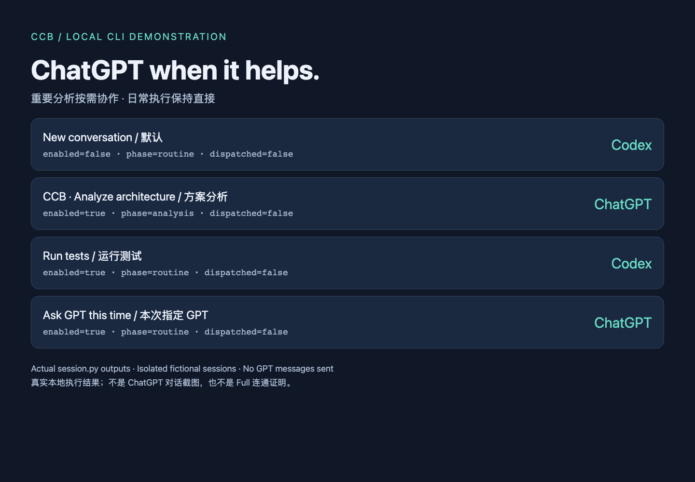
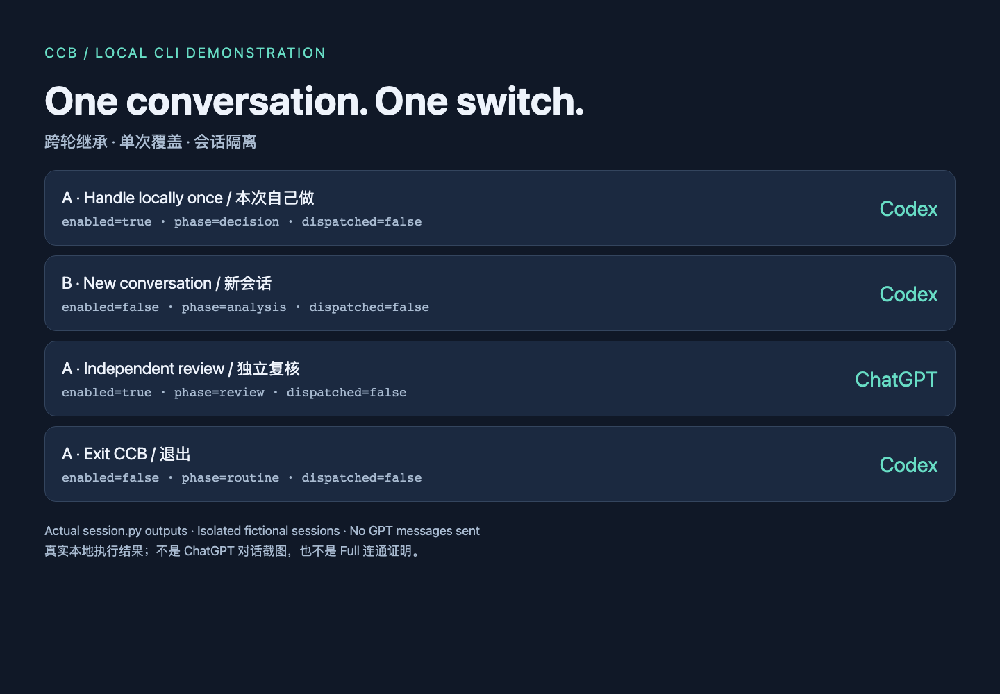

# Share kit / 分享素材

[中文与英文 X 草稿](x-drafts.md)

These are screenshots of a locally rendered demonstration report, populated by actual
scripts/session.py subprocess outputs in an isolated temporary state directory. They are not
ChatGPT UI captures and do not claim fresh Full/MCP or real GPT dispatch verification.
All cases have dispatched=false: the helper selects a participant but does not send messages.

这些是本地演示报告截图，数据来自隔离临时状态中的真实 CLI 执行。
不是 ChatGPT 对话截图，不代表本轮重新验收 Full；没有显示个人账号、路径或聊天。

Reproduce with Node.js, Playwright and Chromium available:
`node scripts/render_share_demo.cjs`. Rendering tools are optional and not needed to use CCB.

Publish only after checking repository access and reviewing SHARING_REVIEW.md.
No X post or draft-box write was performed; the owner can edit the copy before publication.
